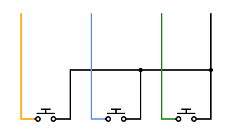

# Hardware Password Manager

## Overview

In light of the recent LastPass data breach, I wanted to create a password manager that stores my master passwords. I know myself the best, and I realize that my current password practice for master passwords isn't the best. I used to feel more secure because of 2FA and hardware tokens, but if the encryption key only uses the master password and ignores these other measures, they become useless.

## LastPass Incident Recap

For those who may not have been following the news, LastPass experienced a data breach in August-December 2022. Encrypted user data was stolen, along with unencrypted URLs, emails, and other information.

A quick note: why only encrypt the password and login field? Wouldn't it be simpler to encrypt the entire dataset and store/reference it using a hash?

## Hardware Requirements

For this project, I am using the following hardware:

- Arduino Leonardo R3 (*must support the [Keyboard](https://www.arduino.cc/reference/en/language/functions/usb/keyboard/) and [LiquidCrystal](https://www.arduino.cc/reference/en/libraries/liquidcrystal/) library*)
- AZDelivery HD44780 16x2 LCD Module Display [(amzn)](https://smile.amazon.de/gp/product/B07JH6GHPR/)
- 12 x 30 breadboard
- Tactile 4Pin Buttons (any button will do)

## Setup

Now, let's begin building. The wiring is relatively straightforward:  

Color Coding:

**Orange**: `PIN22` (represented as `PIN_PREV_BTN`)  
**Blue**: `PIN23` (represented as `PIN_OUT_BTN`)  
**Green**: `PIN24` (represented as `PIN_NXT_BTN`)  
**Black**: `GND` (Ground)  

## Running

## Troubleshooting

## Additional Information
